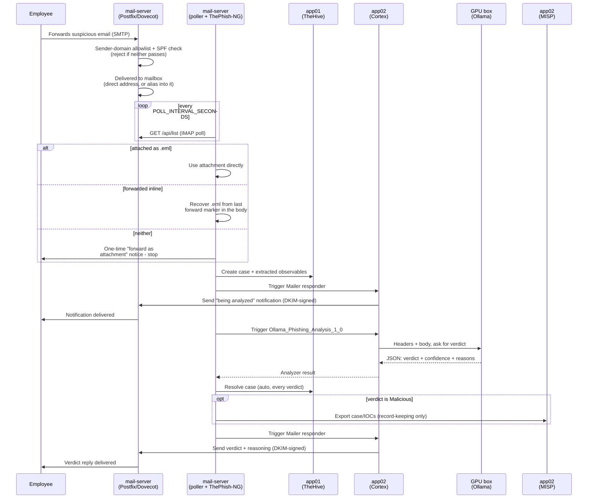

# Self-hosted phishing/spam triage pipeline

Employees forward suspicious emails - as an attachment, or just forwarded
inline - to a dedicated mailbox. From there it's fully automatic: no
analyst has to open a UI or click "Analyze". A poller drives
[ThePhish-NG](https://github.com/dead-plant/ThePhish-NG), which extracts
observables and orchestrates analysis via Cortex + TheHive + MISP -
including a custom Cortex analyzer that sends the email content to a
local Ollama instance for LLM-based phishing/social-engineering analysis,
as a signal alongside the existing threat-intel checks (currently the
only signal actually enabled - see "Email flow" below). A detailed
verdict - including the model's own reasoning - is emailed back to
whoever forwarded the message, via Cortex's own Mailer responder (see
`mail-server/README.md` for why that split matters).

## Email flow

What actually happens, end to end, and which host does it. Every step
here has been confirmed live against real forwarded email, not just
tested in isolation - see each host's own README for the specific
gotchas found along the way.

1. **Employee forwards the email** to the triage mailbox - either
   `phishing@pwned.email` directly, or any alias that delivers into it
   (e.g. `check@spam.jfi.systems` - see `mail-server/README.md`'s "Adding
   another landing address/domain"). Forwarding as an attachment works
   as designed; forwarding inline (most mail clients' default "Forward")
   also works, recovered from the body text - see step 3.
2. **mail-server** (Postfix/Dovecot) receives it on port 25. The sender's
   domain must be on the allowlist (`postfix-config/sender-domain-allowlist`)
   *and* pass SPF, or it's rejected outright with no further processing -
   this is independent of which of our addresses it was sent to. Accepted
   mail is delivered into the mailbox over LMTP.
3. **The poller** (a small script running as its own container, same
   image as ThePhish-NG) calls ThePhish-NG's own `/api/list` on a timer -
   ThePhish-NG has no polling loop of its own. This IMAP-polls the
   mailbox and, for each new message: uses it directly if there's a real
   `.eml`/`message-rfc822` attachment; otherwise tries to recover one from
   the last recognized forward-marker line in the body (Gmail/Outlook/
   Apple Mail styles); if neither works, the sender gets a one-time
   "please forward as an attachment" notice and nothing else happens for
   that message.
4. **The poller calls `/api/analysis`** for each newly listed email.
   ThePhish-NG (`case_from_email.py`) extracts observables (sender
   address/domain, URLs, IPs, file hashes) from the recovered email's
   headers and body, and creates a case in **TheHive (app01)** with those
   observables attached.
5. **Cortex's Mailer responder (app02)** sends the "being analyzed"
   notification back to the employee, over SMTP through mail-server,
   DKIM-signed.
6. **Cortex (app02) runs the enabled analyzers.** For the attached `.eml`
   itself, that's `Ollama_Phishing_Analysis_1_0` (a custom analyzer -
   upstream only ever auto-triggers Yara by default for file observables,
   patched to include ours too). For the other extracted observables
   (URLs/domains/IPs/hashes), any enabled stock analyzer would run
   generically - but as of this writing none are actually toggled on for
   this org (VirusTotal/AbuseIPDB API keys exist in `app02/.env` but
   aren't enabled), so **the LLM is currently the only real signal**.
7. **The Ollama analyzer calls the GPU box** with the email's headers and
   body, asking for a structured verdict (`malicious`/`suspicious`/`safe`
   + confidence + reasoning) - see `ollama-analyzer/README.md`'s "Model
   choice" for why this runs `gpt-oss:latest` (local, 20B) rather than a
   cloud model or the originally-deployed Qwen3.
8. **ThePhish-NG resolves the case** based on the analyzer result -
   Malicious if any observable came back malicious, Suspicious if any
   came back suspicious, Spam if the Ollama analyzer flagged unsolicited
   bulk/commercial mail with no phishing indicators, otherwise Safe
   (see `ollama-analyzer/README.md`'s "Verdict categories" for why Spam
   is kept distinct from Safe rather than lumped together). Every verdict
   auto-resolves the case now (upstream only auto-resolves Malicious/Safe
   by default, leaving Suspicious open indefinitely for manual review -
   patched so the whole pipeline stays hands-off). A Malicious verdict
   also exports the case to **MISP (app02)** - one-way, for
   record-keeping/threat-intel sharing only; nothing about MISP feeds
   back into the verdict itself.
9. **Cortex's Mailer responder** sends the final reply - the verdict,
   the model's actual bullet-point reasoning and confidence, and any
   flagged observables - back to the employee, again DKIM-signed through
   mail-server.

## Hosts

| Host | Role | Status |
|---|---|---|
| GPU box | Ollama (`gpt-oss:latest`, 20B), A5000 24GB VRAM, `0.0.0.0:11434` firewalled to app02 only | already built (outside this repo) |
| `app01/` | TheHive + Cassandra + Elasticsearch | already built, being reconciled into this repo |
| `app02/` | Cortex (+ its own Elasticsearch) + MISP + MariaDB + Redis + the Ollama analyzer | deployed, connected to app01 |
| `mail-server/` | Postfix + Dovecot + ThePhish-NG + the auto-analysis poller | deployed and fully automated - see "Current status" below |

Each host folder is self-contained: its own `docker-compose.yml`, its own
`.env.example` (copy to `.env`, fill in real secrets, never commit `.env`
- see `.gitignore`).

## Deployment order and dependencies

1. **app01** (TheHive) - no dependency on anything else. TheHive's Cortex
   and MISP connector modules are enabled but unconfigured, so it runs
   standalone without erroring on a missing Cortex connection.
2. **app02** (Cortex + MISP) - depends on the GPU box being reachable
   (the Ollama analyzer calls out to it) and needs app01's TheHive URL +
   API key entered into MISP/Cortex config where relevant. Once app02 is
   up, go back into app01's `thehive/conf/application.conf` and either
   uncomment the `cortex`/`misp` blocks or configure the connection via
   TheHive's UI (Platform management → Connectors).
3. **mail-server** (ThePhish-NG + Postfix/Dovecot) - depends on both app01
   and app02 being reachable (needs TheHive + Cortex + MISP API keys and
   URLs), and app02 needs its Mailer responder pointed back at this host
   once it's up (see `app02/README.md`'s "The Mailer responder"). Built
   last, for testing purposes co-located on app02's host rather than
   dedicated hardware.

## Version compatibility notes

- **TheHive 5** moved to a "freemium/private-source" licensing model in
  2024 (no longer developed fully in the open), but still ships a free
  Community license and a public Docker image (`strangebee/thehive:5.x`)
  usable for self-hosting. TheHive 4 is the last fully open-source (AGPL)
  version and has been EOL since Dec 2022.
- **TheHive requires both Cassandra and Elasticsearch** - there's no
  supported Elasticsearch-only mode, in either TheHive 4 or 5.
- **The original [ThePhish](https://github.com/emalderson/ThePhish) is
  effectively abandoned** (last commit Aug 2024), hard-pinned to TheHive
  4.1.9 + Cortex 3.1.1 (both EOL), and built on `thehive4py`/`cortex4py`
  v1.x clients that don't speak TheHive 5's rewritten API - it will not
  work against a TheHive 5 + Cortex 4 backend as-is.
- This repo instead targets **TheHive 5.x + Cortex 4.x +
  [ThePhish-NG](https://github.com/dead-plant/ThePhish-NG)** (an actively
  maintained fork that explicitly adds TheHive 5 support via
  `thehive4py`/`cortex4py` 2.1.0). Its own setup docs are incomplete
  ("coming soon" as of this writing) and it ships no Docker image or
  releases/tags - `mail-server/thephish/Dockerfile` builds it from a
  pinned commit SHA instead. It also has no SMTP logic of its own; see
  `mail-server/README.md` for how verdict emails actually get sent.
- Versions currently pinned in `app01/.env.example`: TheHive 5.7.3,
  Cassandra 4.1.11, Elasticsearch 8.19.15 - StrangeBee's own currently
  pinned combination.
- Versions currently pinned in `app02/.env.example`: Cortex 4.1.0 (its own
  Elasticsearch 8.19.15, separate from app01's), MISP core v2.5.44 +
  misp-modules v3.0.9 (MISP's own currently recommended combination),
  MariaDB 10.11, Valkey 7.2.

## Current status

- `app01/` - deployed to the real host and confirmed working (TheHive +
  Cassandra + Elasticsearch all healthy, `/api/status` returning 200).
- `app02/` - deployed to the real host: Cortex + MISP both healthy and
  connected to app01 (Platform management → Connectors shows both). The
  Ollama analyzer (`ollama-analyzer/`) is enabled in Cortex and running
  `gpt-oss:latest` on the real GPU box (see "Email flow" above for why
  that replaced Qwen3) - verdict + reasoning confirmed correct on real
  submitted email, including brand-notification emails that the previous
  model confidently misclassified.
- `mail-server/` - deployed to the real host (co-located on app02) and
  live: employees are actually forwarding real email to it today. Fully
  automated end to end - see "Email flow" above - with several rounds of
  hardening found and fixed against real traffic, not just test cases:
  - The analysis pipeline runs unattended - a poller triggers `/api/list`
    and `/api/analysis` on a timer, no one has to open the UI.
  - Forwarded-inline (not just attached) email is recovered automatically
    instead of being silently dropped.
  - Every verdict (not just Malicious/Safe) auto-resolves the case and
    sends a reply.
  - The reply itself includes the model's actual reasoning/confidence and
    flagged observables, not a bare one-line verdict.
  - A real `.eml`-serialization crash (Unicode characters common in
    ordinary marketing email - smart quotes, figure spaces) that silently
    dropped submissions with zero feedback to the sender has been found
    and fixed.
  - A sender-domain allowlist (deny-by-default) and DKIM signing are both
    live, ahead of exposing this to the internet - see
    `mail-server/README.md`'s relevant sections for the DNS records still
    needed (SPF/DKIM/DMARC, MX) to make it internet-facing.
  - A second landing address (`check@spam.jfi.systems`, aliased into the
    same mailbox) is live, proving the same pipeline supports multiple
    domains without a second ThePhish-NG instance.
